# Deploying the Neighborly App with Azure Functions

## Response reiew 3 success event hub trigger

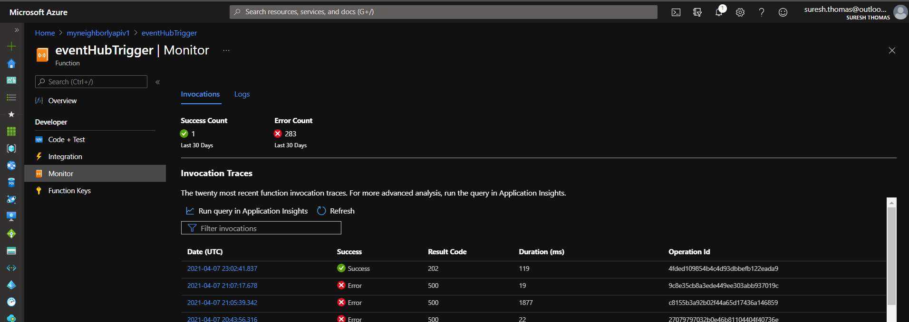

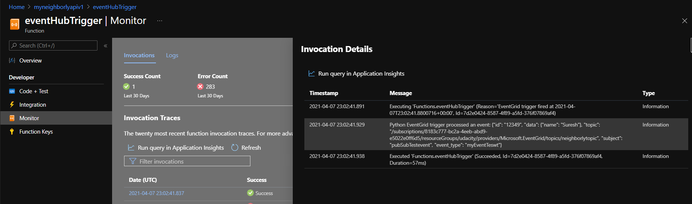


## Response 2 review 2 (07/04/2021)

### Design HTTP trigger and email

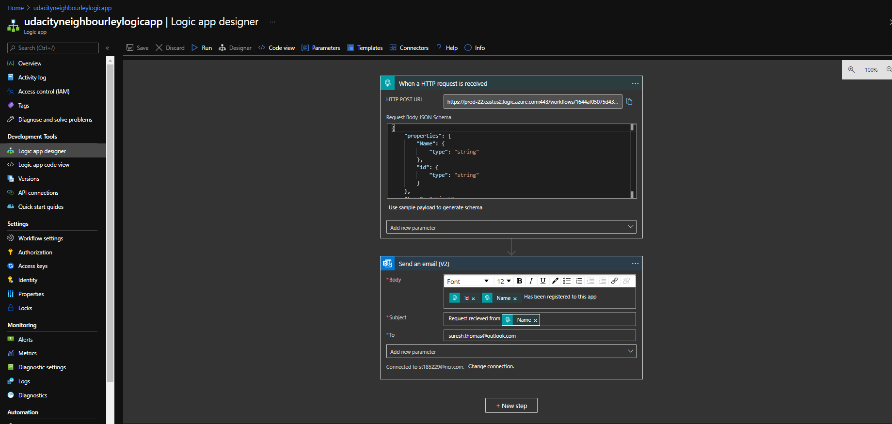

### Create http trigger from postman

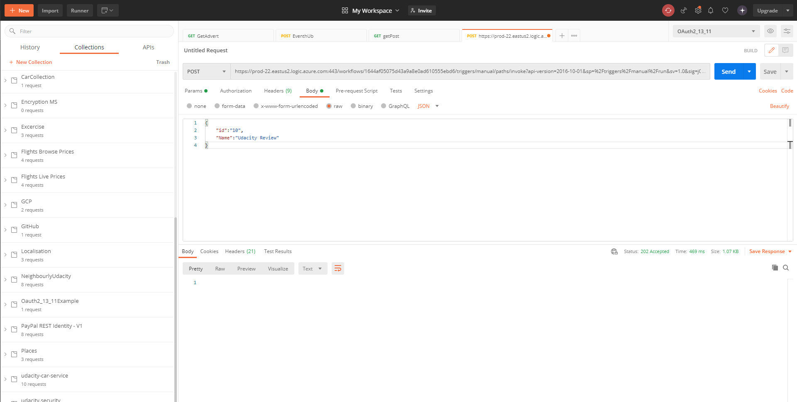

### Email

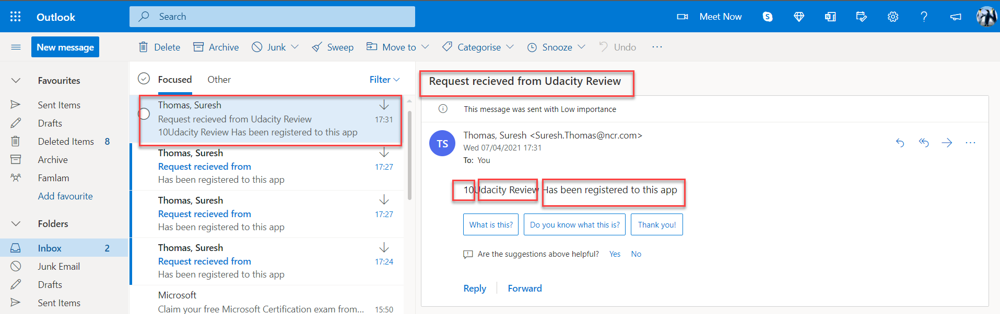

### Runs

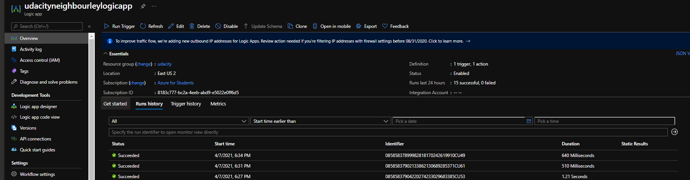

## response to review

- [x] Students are expected to deploy 7 endpoints: createAdvertisement, updateAdvertisement, getAdvertisement, getAdvertisements, and deleteAdvertisement, getPost, getPosts. There should be 7 urls with the format
  
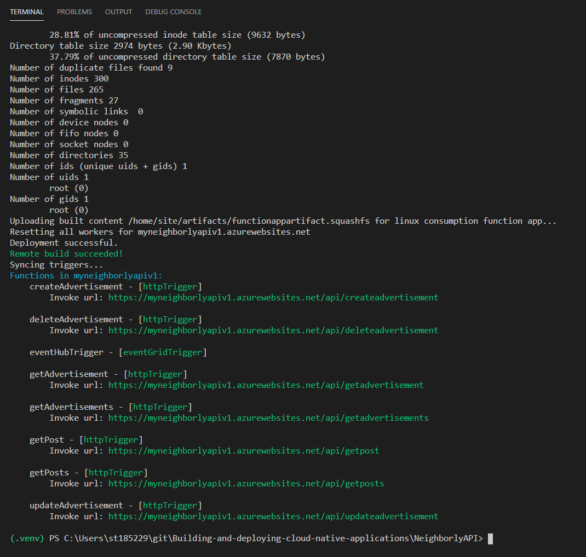

- [x] To verify that the database is configured, the student should be able to retrieve the connection on each of their API endpoints in the server-API application.

These can be verified in the function endpoint, these function endpoints are available. The second one return no value , but function return with 200 OK. So they are all live. Please have a look at the code and see what is the issue 

https://myneighborlyapiv1.azurewebsites.net/api/getadvertisements

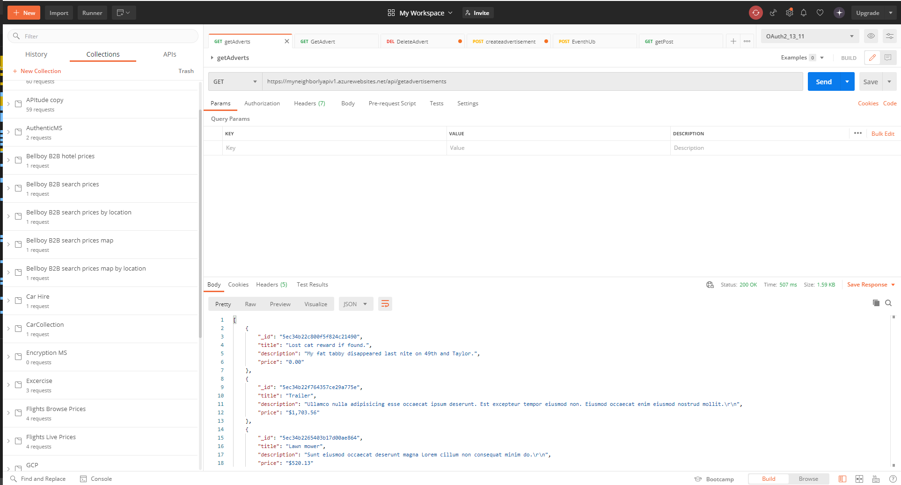

https://myneighborlyapiv1.azurewebsites.net/api/getAdvertisement?id=5ec34b22b5f7f6eac5f2ec3e

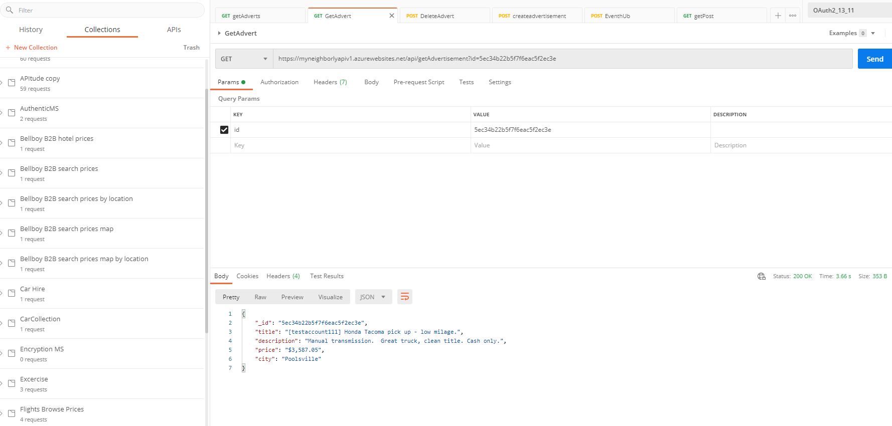

https://myneighborlyapiv1.azurewebsites.net/api/deleteadvertisement?id=5ec34b22b5f7f6eac5f2ec3e

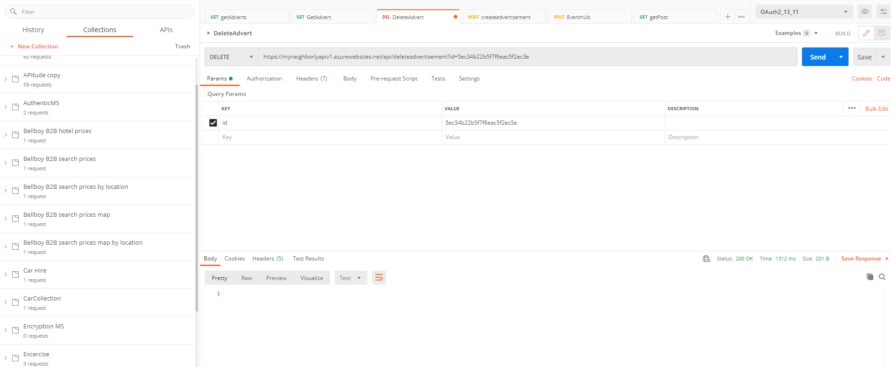

https://myneighborlyapiv1.azurewebsites.net/api/createadvertisement

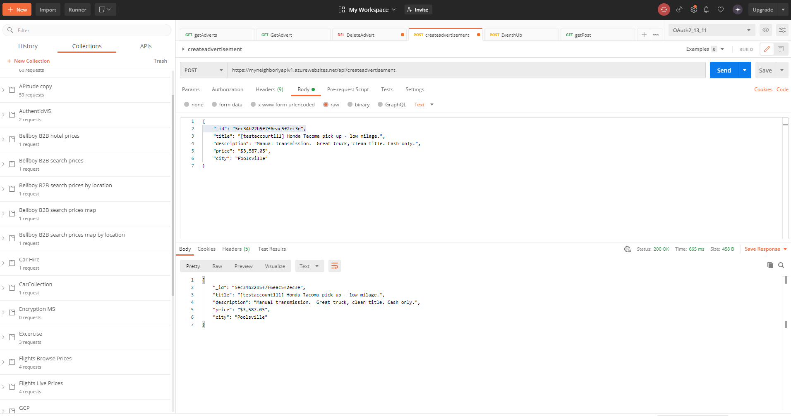

- [x] Please provide a screenshot showing successful requests (messages) to the eventHub or eventGrid trigger. 

I can see they are executing , but failing due to some issues in python. I have not changed any python code I am not getting any help from mentors. So please let me know whether you can help

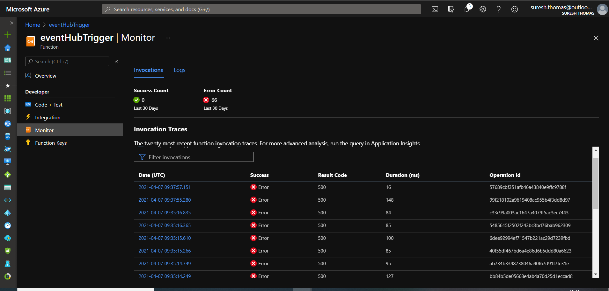
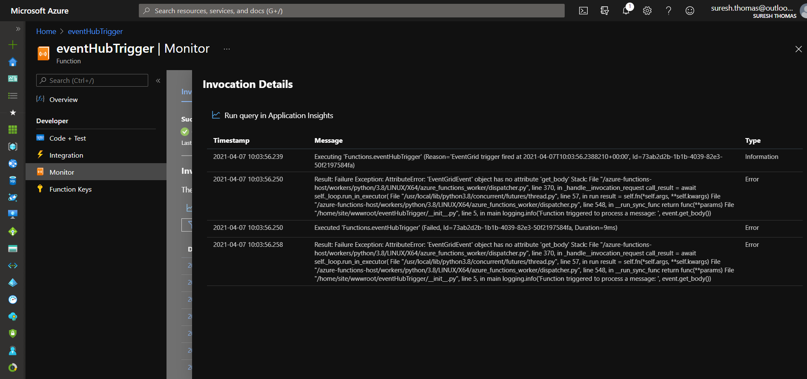


## Details of submission

## URL details

| Id        | URL           |
| ------------- |:-------------:|
| Application     | [Web app](https://neighborlyfrontendst87993.azurewebsites.net/) |
| Function adverts      | [Adverts](https://myneighborlyapiv1.azurewebsites.net/api/getAdvertisements?)      |
|Function Post | [Post](https://myneighborlyapiv1.azurewebsites.net/api/getPosts?)      |


In case you need to return to the project later on, it is suggested to store any commands you use so you can re-create your work. You should also take a look at the project rubric to be aware of any places you may need to take screenshots as proof of your work (or else keep your resource up and running until you have passed, which may incur costs).

### I. Creating Azure Function App

We need to set up the Azure resource group, region, storage account, and an app name before we can publish.

The entire work has been aggregated into a script [create env](env_setup.sh)

1. Create a resource group.

- [x] done - az group create --name `udacity` --location `eastus2`

1. Create a storage account (within the previously created resource group and region)

- [x] az storage account create --name `udacityststorage` --resource-group  `udacity` --location `eastus2`

1. Create an Azure Function App within the resource group, region and storage account. 

- [x] `
python -m venv .venv`
- [x] `.venv\scripts\activate
`
- [x] `az functionapp create --resource-group udacity --consumption-plan-location eastus2 --runtime python --runtime-version 3.8  --functions-version 3 --name myneighborlyapiv1  --storage-account udacityststorage   --os-type linux`


  - [x] Note that app names need to be unique across all of Azure. 
  - [x]  Make sure it is a Linux app, with a Python runtime.

    The successful output, app `myneighborlyapiv1`:

    ```bash
    Your Linux function app 'myneighborlyapiv1', that uses a consumption plan has been successfully created but is not active until content is published using Azure Portal or the Functions Core Tools.
    ```

1. Set up a Cosmos DB Account. You will need to use the same resource group, region and storage account, but can name the Cosmos DB account as you prefer. **Note:** This step may take a little while to complete (15-20 minutes in some cases).

- [x] `az cosmosdb create  -n udacitynblydbacc  -g udacity --kind MongoDB --server-version 3.6 --default-consistency-level Eventual --locations regionName=useast2 failoverPriority=0 isZoneRedundant=False`

1. Create a MongoDB Database in CosmosDB Azure and two collections, one for `advertisements` and one for `posts`.

- [x] `az cosmosdb mongodb database create -a udacitynblydbacc   -g udacity  -n neighborlymongodb`

- [x] `az cosmosdb mongodb collection create -a udacitynblydbacc   -g udacity   -d neighborlydb -n advertisements --throughput 400`

- [x] `az cosmosdb mongodb collection create -a udacitynblydbacc   -g udacity   -d neighborlydb -n posts --throughput 400`

1. Print out your connection string or get it from the Azure Portal. Copy/paste the **primary connection** string.  You will use it later in your application.

    Example connection string output:

    ```bash
    bash-3.2$ az cosmosdb keys list -n udacitynblydbacc  -g udacity --type connection-strings
    ```

    ```json
    {
        "connectionStrings": [
        {
        "connectionString": "mongodb://udacitynblydbacc:aPeRPwiiJvoHGtaHrUhIBxD65Q4vvTXRZV96qCXX0PtIq5cbiAMV40CbfGu4wsJkDuMnIdwbR5In8acYfZ5gJQ==@udacitynblydbacc.mongo.cosmos.azure.com:10255/?ssl=true&replicaSet=globaldb&retrywrites=false&maxIdleTimeMS=120000&appName=@udacitynblydbacc@",
        "description": "Primary MongoDB Connection String"
        },
        {
        "connectionString": "mongodb://udacitynblydbacc:0bBylbrsaJbkTng0NI140FcKncsiC4BFIZyTMhQ00bgduJgUKL6F0k0fhn5ayMMfIjuZT8QiutTIRhfGNMmQ6A==@udacitynblydbacc.mongo.cosmos.azure.com:10255/?ssl=true&replicaSet=globaldb&retrywrites=false&maxIdleTimeMS=120000&appName=@udacitynblydbacc@",
        "description": "Secondary MongoDB Connection String"
        },
        {
        "connectionString": "mongodb://udacitynblydbacc:TR1Bn8esVVV1NbZs9Ql2E9vbgyqfxMR8dRjwmTrUOsbnElkjBx94B5XFReEESuwrXTack6jq1g5mPbzIRjq0wQ==@udacitynblydbacc.mongo.cosmos.azure.com:10255/?ssl=true&replicaSet=globaldb&retrywrites=false&maxIdleTimeMS=120000&appName=@udacitynblydbacc@",
        "description": "Primary Read-Only MongoDB Connection String"
        },
        {
        "connectionString": "mongodb://udacitynblydbacc:fAJrXua0Biy70yZw2MfvMtprP9UdeiHMZXdsW0vKltzOzOCJS8yZ9hE8F8Hb1C6aEMkuJyO7kCqWrdbzv7YUwA==@udacitynblydbacc.mongo.cosmos.azure.com:10255/?ssl=true&replicaSet=globaldb&retrywrites=false&maxIdleTimeMS=120000&appName=@udacitynblydbacc@",
        "description": "Secondary Read-Only MongoDB Connection String"
        }]
    }
    ```

1. Import Sample Data Into MongoDB.

   I have imported through visual studio code 

   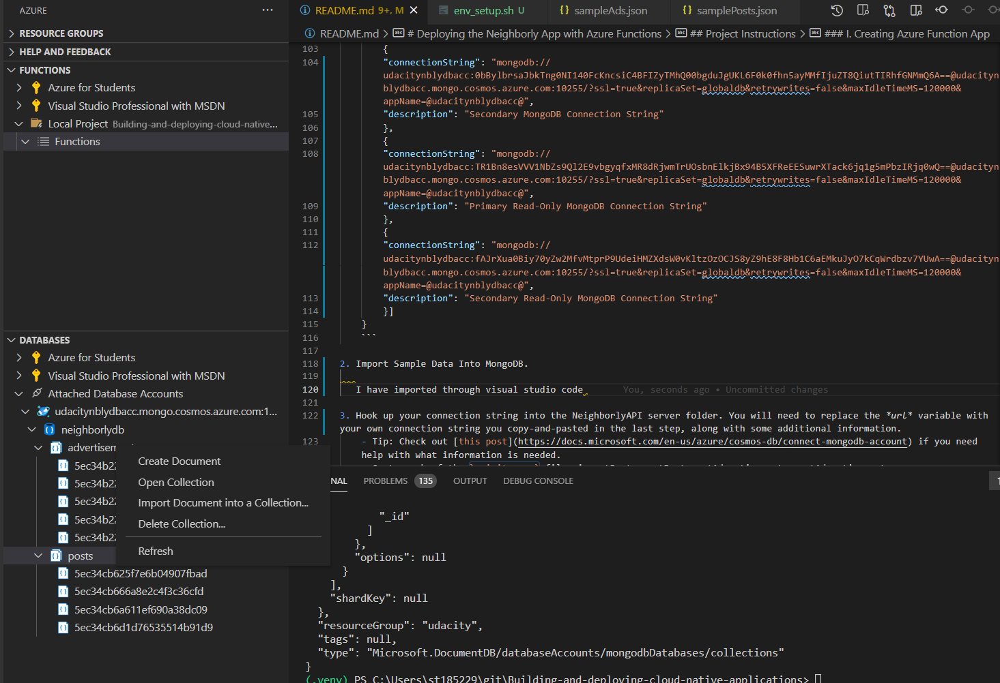

1. Hook up your connection string into the NeighborlyAPI server folder. You will need to replace the *url* variable with your own connection string you copy-and-pasted in the last step, along with some additional information.
    - Tip: Check out [this post](https://docs.microsoft.com/en-us/azure/cosmos-db/connect-mongodb-account) if you need help with what information is needed.
    - Go to each of the `__init__.py` files in getPosts, getPost, getAdvertisements, getAdvertisement, deleteAdvertisement, updateAdvertisement, createAdvertisements and replace your connection string. You will also need to set the related `database` and `collection` appropriately.

    ```bash
    # inside getAdvertisements/__init__.py

    def main(req: func.HttpRequest) -> func.HttpResponse:
        logging.info('Python getAdvertisements trigger function processed a request.')

        try:
            # copy/paste your primary connection url here
            #-------------------------------------------
            url = ""
            #--------------------------------------------

            client=pymongo.MongoClient(url)

            database = None # Feed the correct key for the database name to the client
            collection = None # Feed the correct key for the collection name to the database

            ... [other code omitted]
            
    ```

    Make sure to do the same step for the other 6 HTTP Trigger functions.

1. Deploy your Azure Functions.

    1. Test it out locally first.

        ```bash
        # cd into NeighborlyAPI
        cd NeighborlyAPI

        # install dependencies
        pipenv install

        # go into the shell
        pipenv shell

        # test func locally
        func start
        ```

        You may need to change `"IsEncrypted"` to `false` in `local.settings.json` if this fails.

        At this point, Azure functions are hosted in localhost:7071.  You can use the browser or Postman to see if the GET request works.  For example, go to the browser and type in:

        ```bash
        # example endpoint for all advertisements
        http://localhost:7071/api/getadvertisements

        #example endpoint for all posts
        http://localhost:7071/api/getposts
        ```

    2. Now you can deploy functions to Azure by publishing your function app.

        The result may give you a live url in this format, or you can check in Azure portal for these as well:

        Expected output if deployed successfully:

        ```bash
        Functions in myneighborlyapiv1:
            createAdvertisement - [httpTrigger]
                Invoke url: https://myneighborlyapiv1.azurewebsites.net/api/createadvertisement

            deleteAdvertisement - [httpTrigger]
                Invoke url: https://myneighborlyapiv1.azurewebsites.net/api/deleteadvertisement

            getAdvertisement - [httpTrigger]
                Invoke url: https://myneighborlyapiv1.azurewebsites.net/api/getadvertisement

            getAdvertisements - [httpTrigger]
                Invoke url: https://myneighborlyapiv1.azurewebsites.net/api/getadvertisements

            getPost - [httpTrigger]
                Invoke url: https://myneighborlyapiv1.azurewebsites.net/api/getpost

            getPosts - [httpTrigger]
                Invoke url: https://myneighborlyapiv1.azurewebsites.net/api/getposts

            updateAdvertisement - [httpTrigger]
                Invoke url: https://myneighborlyapiv1.azurewebsites.net/api/updateadvertisement

        ```

        **Note:** It may take a minute or two for the endpoints to get up and running if you visit the URLs.

        Save the function app url **<https://myneighborlyapiv1.azurewebsites.net/api/>** since you will need to update that in the client-side of the application.

### II. Deploying the client-side Flask web application

We are going to update the Client-side `settings.py` with published API endpoints. First navigate to the `settings.py` file in the NeighborlyFrontEnd/ directory.

Use a text editor to update the API_URL to your published url from the last step.

```bash
# Inside file settings.py

# ------- For Local Testing -------
#API_URL = "http://localhost:7071/api"

# ------- For production -------
# where APP_NAME is your Azure Function App name 
API_URL="https://<APP_NAME>.azurewebsites.net/api"
```

### III. CI/CD Deployment

1. Deploy your client app. **Note:** Use a **different** app name here to deploy the front-end, or else you will erase your API. From within the `NeighborlyFrontEnd` directory:
    - Install dependencies with `pipenv install`
    - Go into the pip env shell with `pipenv shell`
    - Deploy your application to the app service. **Note:** It may take a minute or two for the front-end to get up and running if you visit the related URL.

    Make sure to also provide any necessary information in `settings.py` to move from localhost to your deployment.

2. Create an Azure Registry and dockerize your Azure Functions. Then, push the container to the Azure Container Registry.
3. Create a Kubernetes cluster, and verify your connection to it with `kubectl get nodes`.
4. Deploy app to Kubernetes, and check your deployment with `kubectl config get-contexts`.

### IV. Event Hubs and Logic App

1. Create a Logic App that watches for an HTTP trigger. When the HTTP request is triggered, send yourself an email notification.
2. Create a namespace for event hub in the portal. You should be able to obtain the namespace URL.
3. Add the connection string of the event hub to the Azure Function.

### V.  Cleaning Up Your Services

Before completing this step, make sure to have taken all necessary screenshots for the project! Check the rubric in the classroom to confirm.

Clean up and remove all services, or else you will incur charges.

```bash
# replace with your resource group
RESOURCE_GROUP="<YOUR-RESOURCE-GROUP>"
# run this command
az group delete --name $RESOURCE_GROUP
```

## Screenshots

All resources in the namespaces

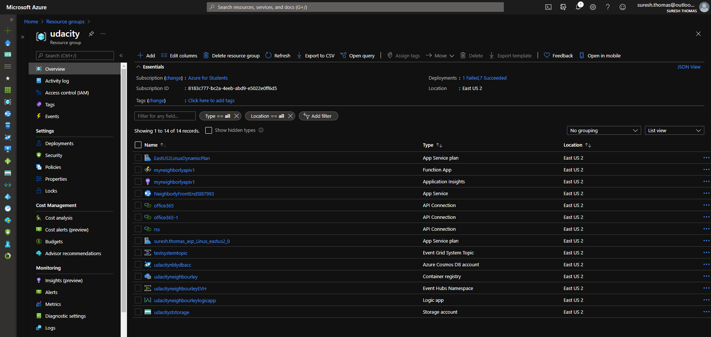

### database and collections

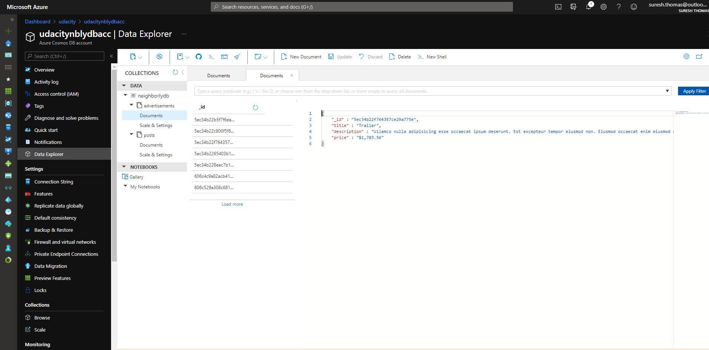
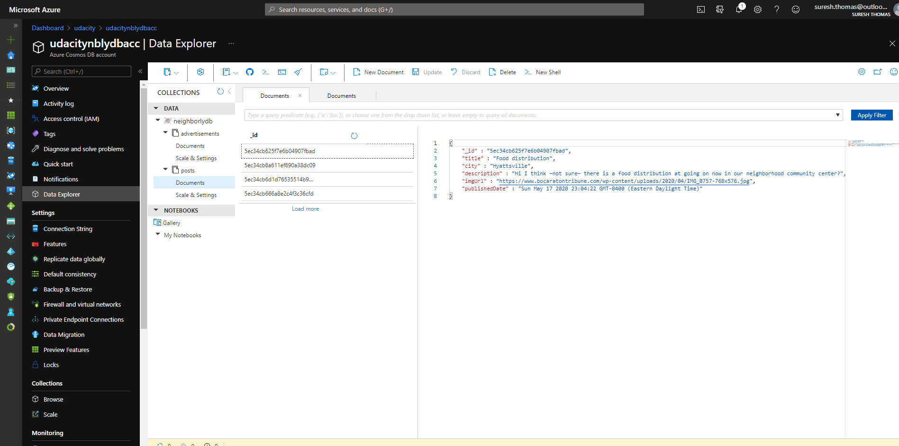
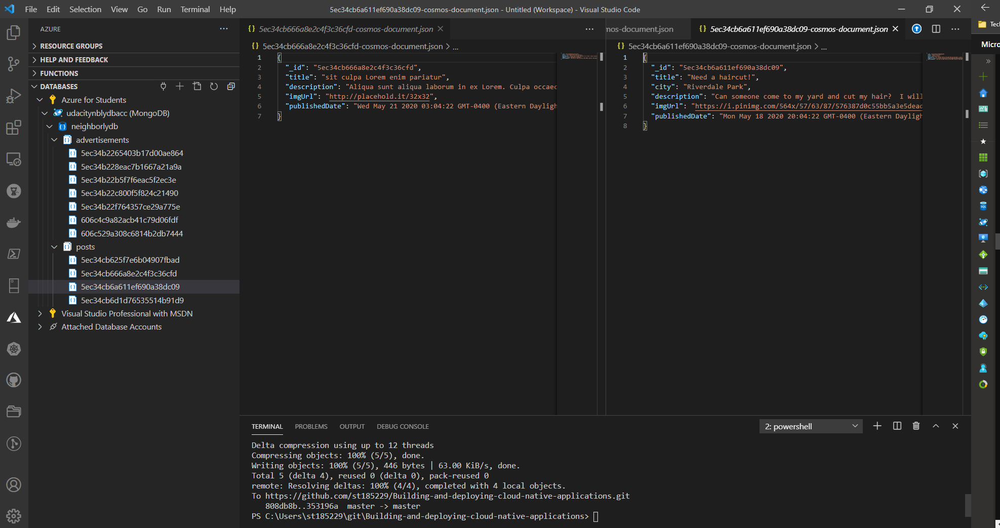

### Function screenshots

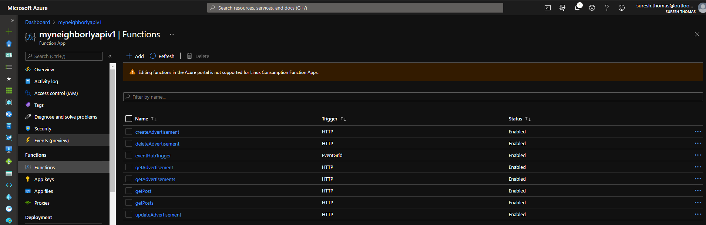
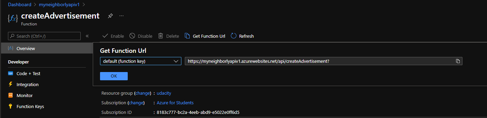
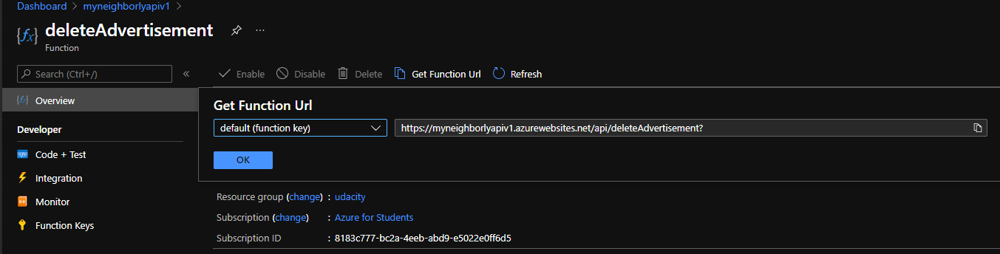
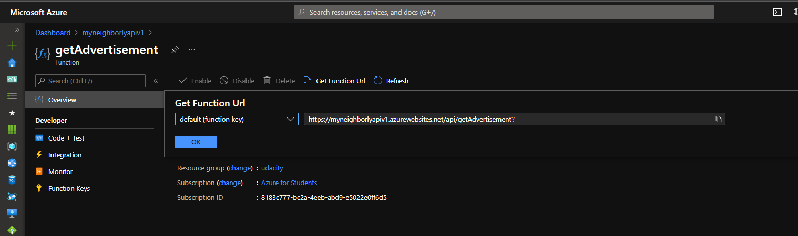
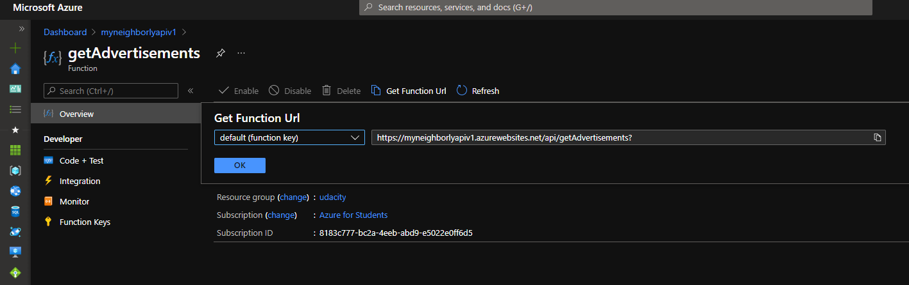

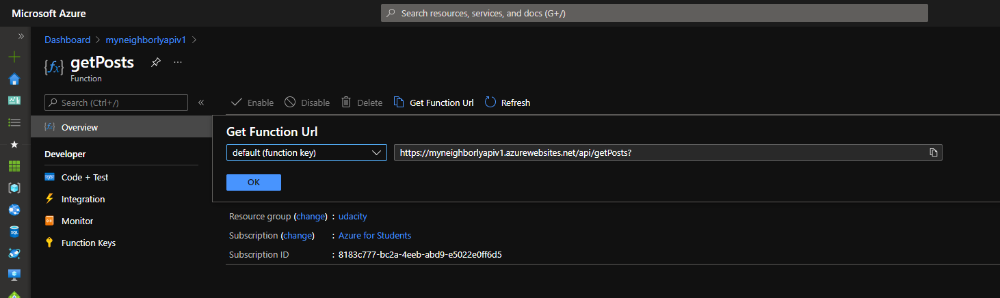
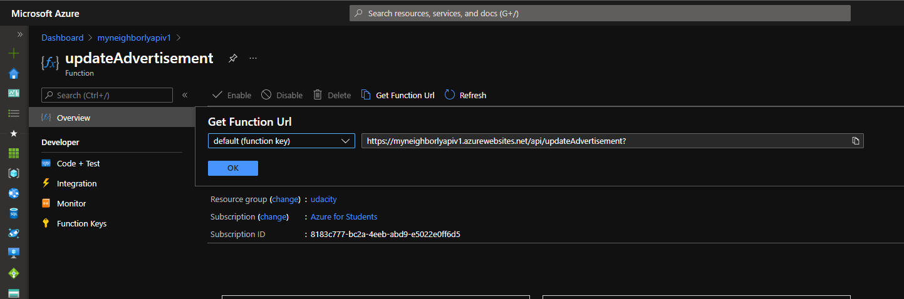


### Get Advertisements

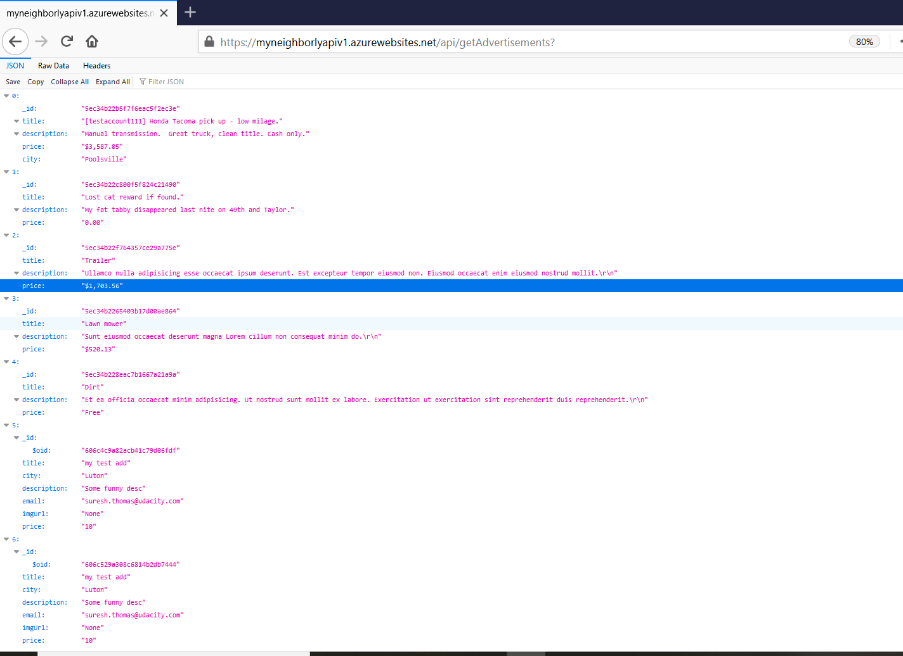

## Logic Apps & Event Hubs

- [x] Students should be able to create a Logic App that watches for an HTTP trigger. When the HTTP request is triggered, the student is sent an email (with Gmail) notification. The student can validate this by a screenshot of their inbox.

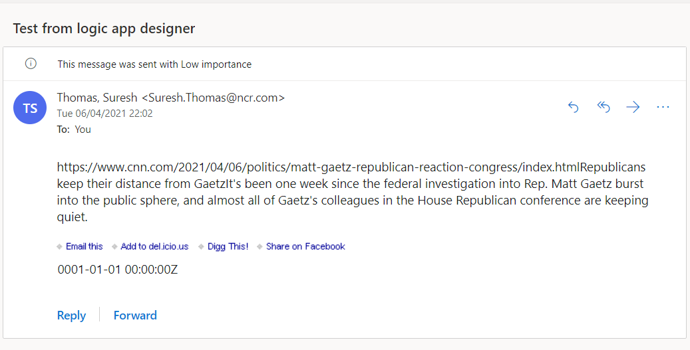

Feed setup

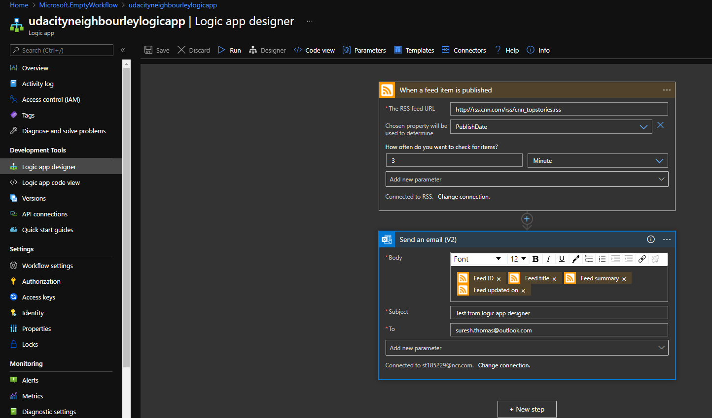

Feed runs

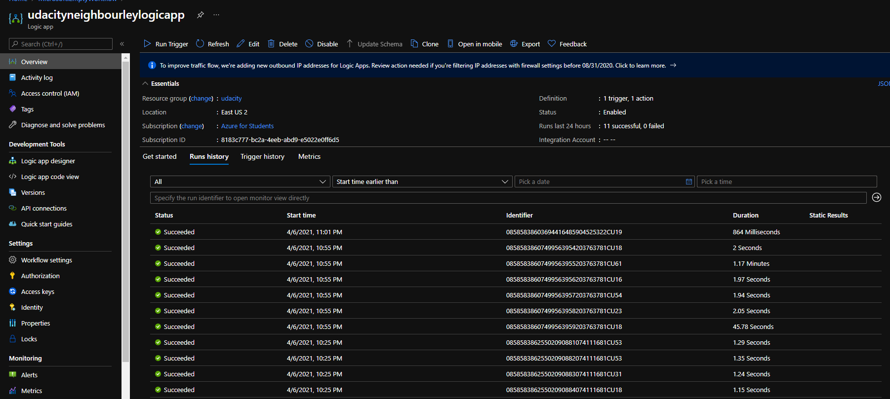

- [x] The student should be able create an Event Hubs namespace and an event hub with the command line or through the portal. If successful, the student can obtain the namespace url. Add a screenshot from the portal of this being live.
  
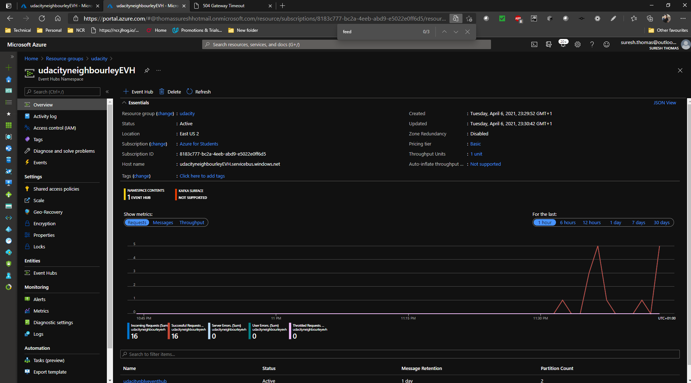

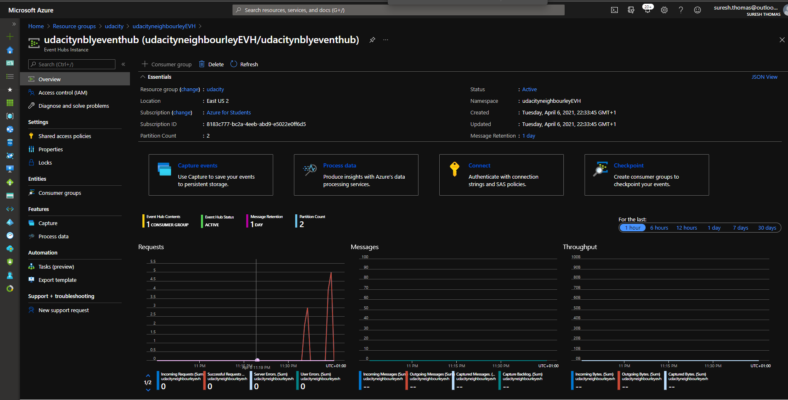

-[x] The student should be able to use the endpoint connection string from the event hub to the eventHubTrigger function in the function.json file.

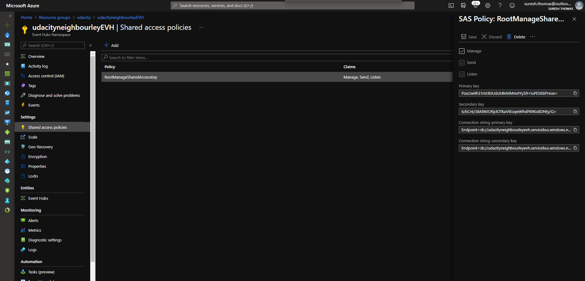

## Deploying Application

- [x] The student should be able to use the live url from Azure App Service in their browser. The URL should be accessible to all users on the World Wide Web, or a screenshot should be provided, including the URL, of the live site.

[https://neighborlyfrontendst87993.azurewebsites.net/](https://neighborlyfrontendst87993.azurewebsites.net/)

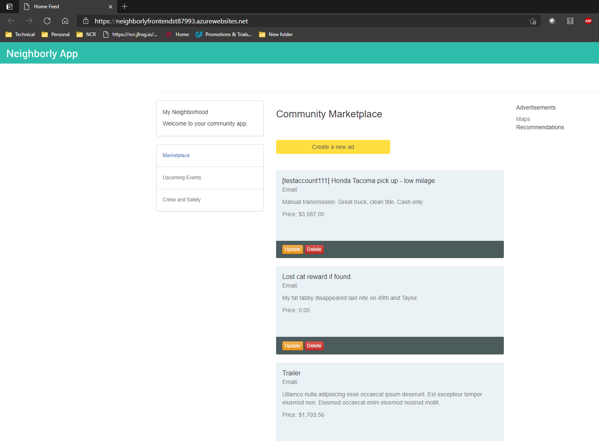

- [x] Provide a screenshot of the Dockerfile from Azure Container Registry as evidence

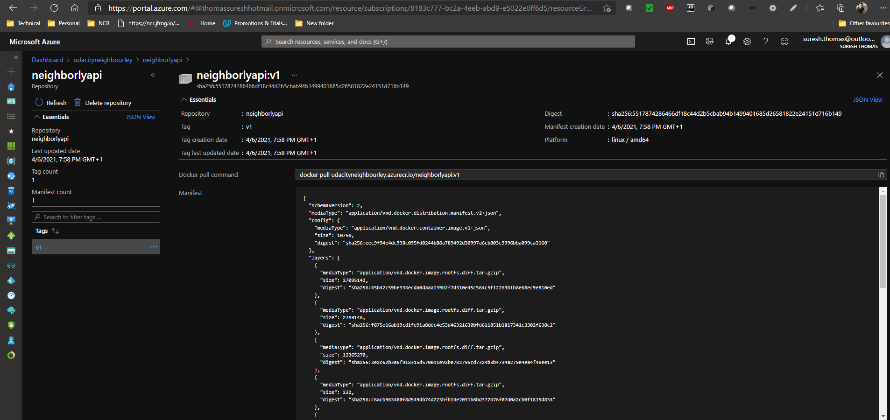

- [x] Provide a screenshot of confirmation from the terminal, or from within Azure, as evidence.

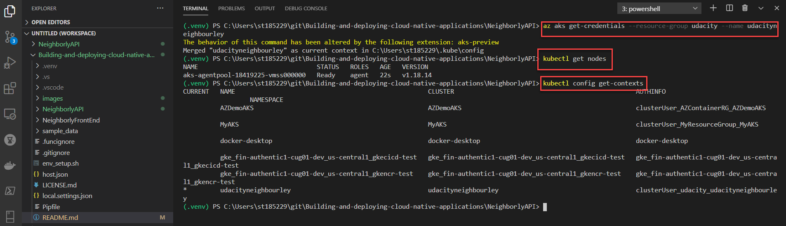

- [X] Funtion deployment

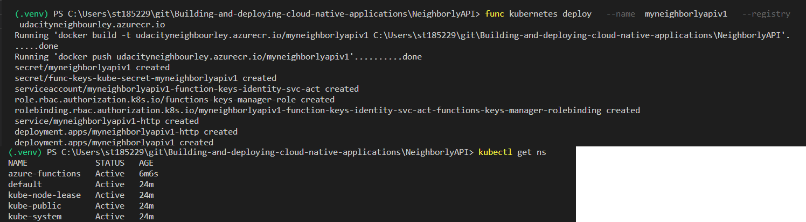

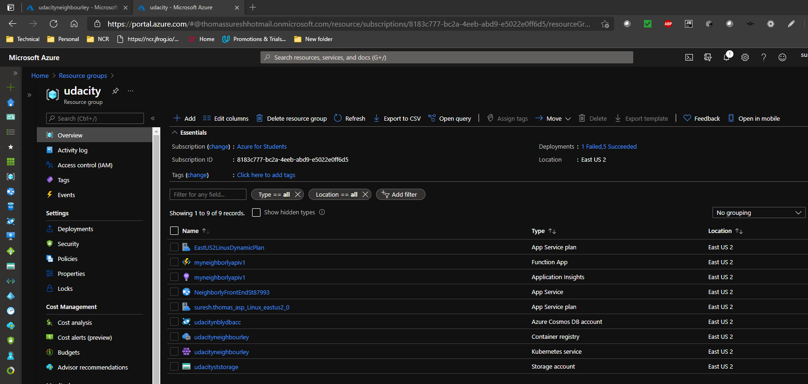
