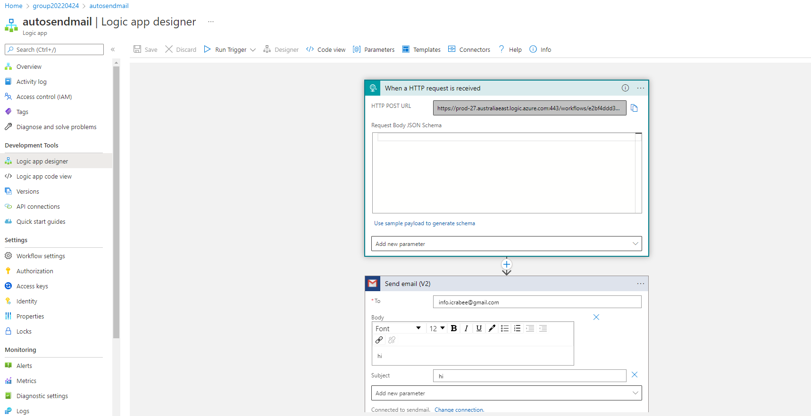

# Deploying the Neighborly App with Azure Functions

## Project Overview

I built a web application called "Neighborly" that allows neighbors to post advertisements for services and products they can offer. The front-end application is built with the Python Flask micro framework. The application makes direct requests to the back-end API endpoints, which allow users to view, create, edit, and delete the community advertisements. The ads and posts are stored in Azure Cosmos DB. 

## Dependencies

You will need to install the following locally:

- [Pipenv](https://pypi.org/project/pipenv/)
- [Visual Studio Code](https://code.visualstudio.com/download)
- [Azure Function tools V3](https://docs.microsoft.com/en-us/azure/azure-functions/functions-run-local?tabs=windows%2Ccsharp%2Cbash#install-the-azure-functions-core-tools)
- [Azure CLI](https://docs.microsoft.com/en-us/cli/azure/install-azure-cli?view=azure-cli-latest)
- [Azure Tools for Visual Studio Code](https://marketplace.visualstudio.com/items?itemName=ms-vscode.vscode-node-azure-pack)
- [MongoDB Database Tools](https://www.mongodb.com/try/download/database-tools)

On Mac, you can do this with:

```bash
# install pipenv
brew install pipenv

# install azure-cli
brew update && brew install azure-cli

# install azure function core tools 
brew tap azure/functions
brew install azure-functions-core-tools@3

# get the mongodb library
brew install mongodb-community@4.2

# check if mongoimport lib exists
mongoimport --version
```

## Deploy the Function App and Web App

1. Create the resources in Azure by running the command below. 
    ```
    bash resource.sh
    ```
    

2. Save the connection string of cosmos account in [local.settings.json] and the function app configuration.

    

3. Deploy the Azure Functions locally and test with Postman. 

    ```bash
    # cd into NeighborlyAPI
    cd NeighborlyAPI

    # install dependencies
    pipenv install

    # go into the shell
    pipenv shell

    # test func locally
    func start
    ```

    

4. Update the Client-side [settings.py] and deploy the webapp locally.
    ```bash
    # Inside file settings.py

    # ------- For Local Testing -------
    API_URL = "http://localhost:<PORT_NUMBER>/api"

    # ------- For production -------
    # where APP_NAME is your Azure Function App name 
    # API_URL="https://<APP_NAME>.azurewebsites.net/api"
    ```
    ```bash
    # cd into NeighborlyFrontEnd
    cd NeighborlyFrontEnd

    # install dependencies
    pipenv install

    # go into the shell
    pipenv shell

    # test the webapp locally
    python app.py   
    ```

5. Deploy the Azure Functions and the webapp with Azure.
    ```bash
    # cd into NeighborlyAPI
    cd NeighborlyAPI

    # install dependencies
    pipenv install

    # go into the shell
    pipenv shell

    # deploy Azure Functions
    func azure functionapp publish funcapp20210411
    ```
    ```bash
    # Inside file settings.py

    # ------- For Local Testing -------
    #API_URL = "http://localhost:<PORT_NUMBER>/api"

    # ------- For production -------
    # where APP_NAME is your Azure Function App name 
    API_URL="https://<APP_NAME>.azurewebsites.net/api"
    ```
    ```bash
    # cd into NeighborlyFrontEnd
    cd NeighborlyFrontEnd

    # install dependencies
    pipenv install

    # go into the shell
    pipenv shell

    # export variable so the Azure stack knows which entry point to start your Flask app.  If your application file is named `application.py` or `something_else.py`, then you can replace that here.    
    export FLASK_RUN=app.py

    # deploy the webapp 
    az webapp up \
        --resource-group group20210411 \
        --name neighborlyapp \
        --sku F1 \
        --verbose
    ```
6. Containerize the Functions for AKS deployment.
    ```bash
    pipenv shell
    
    bash docker.sh
    ```
    Obtain the endpoint and update the URL of the settings.py file.
    ```bash
    # Inside file settings.py

    # ------- For Local Testing -------
    #API_URL = "http://localhost:<PORT_NUMBER>/api"

    # ------- For production -------
    # where IP_ADDRESS is the dockerized function endpoint 
    API_URL="https://<IP_ADDRESS>/api"
    ```   
    Test the webapp with the updated docerized function endpoint.
     ```bash
    # cd into NeighborlyFrontEnd
    cd NeighborlyFrontEnd

    # install dependencies
    pipenv install

    # go into the shell
    pipenv shell

    # test the webapp locally
    python app.py   
    ```
7. Create a Logic App that watches for an HTTP trigger. When the HTTP request is triggered, send an email notification.

8. Create a namespace for event hub in the portal and obtain the namespace URL.

9. Link to app: https://neighborlyapp20220424.azurewebsites.net